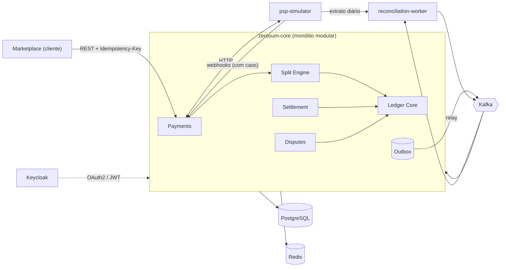
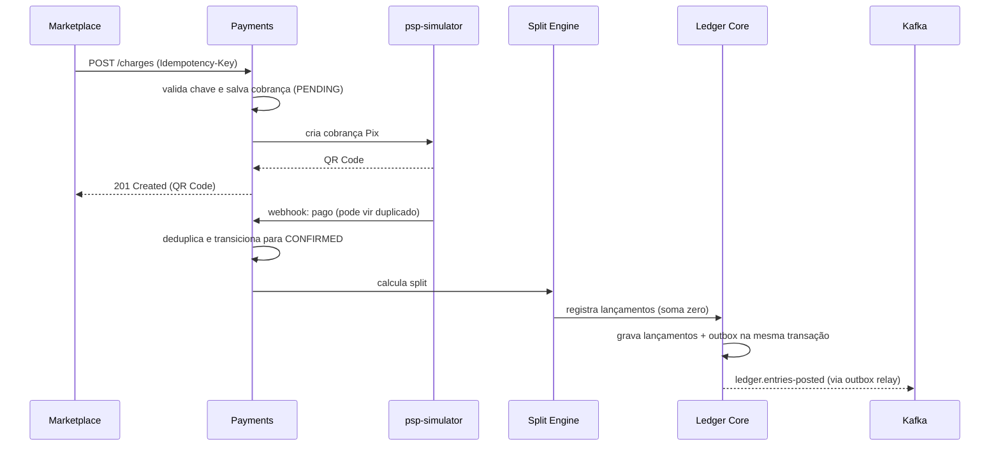
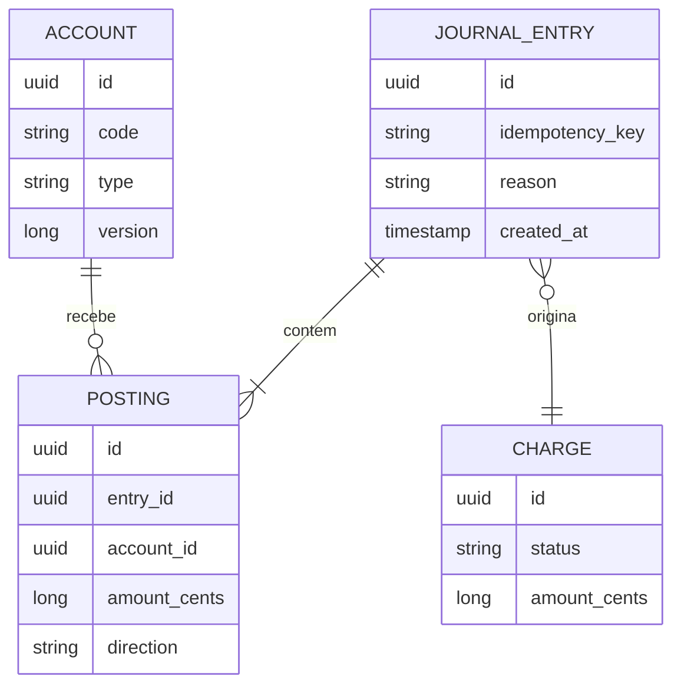

# ZeroSum

**Motor de split de pagamentos e ledger de partidas dobradas para marketplaces.**


> 🚧 **Projeto em construção.** Este README descreve a arquitetura planejada. O progresso real está no [Roadmap](#-roadmap), e cada item marcado corresponde a código e testes já existentes no repositório.

---

## Sumário

- [O problema](#-o-problema)
- [A solução](#-a-solução)
- [Regras de domínio](#-regras-de-domínio)
- [Cenários de falha tratados](#-cenários-de-falha-tratados)
- [Arquitetura](#-arquitetura)
- [Modelo do ledger](#-modelo-do-ledger)
- [Eventos](#-eventos)
- [API](#-api)
- [Stack](#-stack)
- [Decisões de arquitetura (ADRs)](#-decisões-de-arquitetura-adrs)
- [Estrutura do repositório](#-estrutura-do-repositório)
- [Como executar](#-como-executar)
- [Estratégia de testes](#-estratégia-de-testes)
- [Observabilidade](#-observabilidade)
- [Roadmap](#-roadmap)

---

## 🎯 O problema

Quando um cliente paga R$ 150,00 em um marketplace, esse dinheiro não pertence a uma única parte. Ele precisa ser dividido entre um ou mais vendedores, a plataforma, o provedor de pagamento (PSP) e, eventualmente, entregadores ou afiliados.

Fazer essa divisão uma vez é simples. Mantê-la **correta ao longo do tempo** é difícil:

- **Estornos e chargebacks** chegam dias ou semanas depois, quando o vendedor já sacou o valor. O saldo fica negativo e precisa ser compensado em recebimentos futuros.
- **Webhooks do PSP** chegam duplicados, fora de ordem, atrasados ou simplesmente não chegam.
- **Arredondamento**: dividir R$ 100,00 em três partes iguais gera um centavo "perdido". Em sistemas financeiros, centavo perdido é bug.
- **Conciliação**: o extrato do PSP precisa bater com os registros internos, e qualquer divergência precisa ser detectada.
- **Liquidação**: vendedores recebem em D+N, com parte do valor retida como reserva de risco.
- **Concorrência**: dois eventos simultâneos não podem gerar saldo inconsistente nem pagamento duplicado.

## 💡 A solução

O **ZeroSum** é um backend que recebe cobranças de marketplaces, aplica regras de divisão configuráveis, registra cada movimentação em um **ledger imutável de partidas dobradas** e controla todo o ciclo de vida do dinheiro: confirmação, liquidação, estorno, chargeback e conciliação.

Princípios centrais:

1. **O ledger é a fonte da verdade.** Saldos nunca são armazenados como valor mutável; são derivados dos lançamentos.
2. **Toda operação é idempotente.** Repetir uma requisição ou reprocessar um evento nunca duplica dinheiro.
3. **Nenhum evento é publicado sem que a transação tenha sido confirmada** (Transactional Outbox).
4. **O sistema é testado contra um PSP hostil.** Um simulador envia falhas propositalmente.

---

## 📐 Regras de domínio

| Regra                                   | Descrição                                                                                          |
| --------------------------------------- | -------------------------------------------------------------------------------------------------- |
| **RD-01** Soma zero                     | Todo lançamento contábil tem soma de débitos igual à soma de créditos.                             |
| **RD-02** Imutabilidade                 | Lançamentos nunca são alterados ou apagados. Correções são feitas com lançamentos de reversão.     |
| **RD-03** Dinheiro em centavos          | Valores são representados como inteiros em centavos (`long`), nunca `double`.                      |
| **RD-04** Arredondamento determinístico | Divisões usam o método do maior resto. A soma das partes sempre é igual ao total.                  |
| **RD-05** Split configurável            | Cada marketplace define regras: percentual, valor fixo ou combinação, por vendedor e por taxa.     |
| **RD-06** Liquidação D+N                | Valores ficam disponíveis ao vendedor após N dias, configurável por marketplace.                   |
| **RD-07** Reserva de risco              | Um percentual de cada venda fica retido por um período para cobrir chargebacks.                    |
| **RD-08** Saldo negativo                | Chargebacks após saque geram saldo negativo, compensado automaticamente em recebimentos futuros.   |
| **RD-09** Idempotência                  | Toda requisição de escrita exige `Idempotency-Key`. Chaves repetidas retornam a resposta original. |
| **RD-10** Máquina de estados            | Cobranças seguem transições válidas. Eventos que violam a ordem são rejeitados ou reordenados.     |

**Exemplo de arredondamento (RD-04):** R$ 100,00 dividido igualmente entre 3 vendedores.

| Vendedor  | Divisão ingênua | Maior resto   |
| --------- | --------------- | ------------- |
| A         | 33,33           | **33,34**     |
| B         | 33,33           | 33,33         |
| C         | 33,33           | 33,33         |
| **Total** | **99,99** ❌    | **100,00** ✅ |

---

## 💥 Cenários de falha tratados

Cada cenário é coberto por pelo menos um teste automatizado, referenciado na coluna "Teste".

| #    | Cenário                                                 | Comportamento esperado                                                     | Teste           |
| ---- | ------------------------------------------------------- | -------------------------------------------------------------------------- | --------------- |
| F-01 | Cliente reenvia a mesma cobrança                        | Retorna a resposta original, sem nova cobrança                             | _a implementar_ |
| F-02 | PSP envia o mesmo webhook 5 vezes                       | Apenas um lançamento é registrado                                          | _a implementar_ |
| F-03 | Webhook de "estornado" chega antes de "confirmado"      | Evento é reordenado ou mantido pendente até o estado válido                | _a implementar_ |
| F-04 | Webhook de confirmação nunca chega                      | Job de verificação ativa consulta o PSP e resolve o estado                 | _a implementar_ |
| F-05 | Chargeback após o vendedor sacar                        | Saldo fica negativo e é compensado em vendas futuras                       | _a implementar_ |
| F-06 | Aplicação cai entre salvar no banco e publicar no Kafka | Outbox garante a publicação após o restart                                 | _a implementar_ |
| F-07 | Consumidor processa a mesma mensagem duas vezes         | Consumidor idempotente ignora a duplicata                                  | _a implementar_ |
| F-08 | Dois payouts simultâneos para o mesmo vendedor          | Lock otimista impede saque acima do saldo                                  | _a implementar_ |
| F-09 | Extrato do PSP diverge do ledger                        | Divergência registrada e evento de alerta publicado                        | _a implementar_ |
| F-10 | PSP fora do ar                                          | Circuit breaker abre; requisições falham rápido e são reprocessadas depois | _a implementar_ |

---

## 🏗 Arquitetura

O zerosum é um **monólito modular** (Spring Modulith) com dois serviços auxiliares. A escolha está justificada no [ADR-0001](docs/adr/0001-monolito-modular.md): as fronteiras entre módulos são reais e verificadas por testes, mas sem o custo operacional de muitos microsserviços.



### Módulos

| Módulo                    | Responsabilidade                                                                                |
| ------------------------- | ----------------------------------------------------------------------------------------------- |
| **Payments**              | Recebe cobranças, controla a máquina de estados, trata webhooks e idempotência.                 |
| **Split Engine**          | Aplica as regras de divisão do marketplace e calcula as partes em centavos.                     |
| **Ledger Core**           | Registra lançamentos de partidas dobradas e calcula saldos. Único módulo que escreve no ledger. |
| **Settlement**            | Agenda de liquidação D+N, reserva de risco e payouts.                                           |
| **Disputes**              | Saga de estornos e chargebacks, incluindo saldo negativo e compensação.                         |
| **reconciliation-worker** | Serviço separado que compara o extrato do PSP com o ledger.                                     |
| **psp-simulator**         | PSP falso configurável para duplicar, atrasar, reordenar ou omitir webhooks.                    |

### Fluxo principal: cobrança Pix



---

## 📒 Modelo do ledger

Cada movimentação gera um **lançamento** (`journal_entry`) com duas ou mais **partidas** (`posting`). A soma das partidas é sempre zero.

**Exemplo:** venda de R$ 100,00, taxa da plataforma de 10%, taxa do PSP de R$ 1,99 absorvida pela plataforma.

| Conta                         |     Débito |    Crédito |
| ----------------------------- | ---------: | ---------: |
| `psp:recebivel`               |      98,01 |            |
| `plataforma:despesa-taxa-psp` |       1,99 |            |
| `vendedor:{id}:a-pagar`       |            |      90,00 |
| `plataforma:receita`          |            |      10,00 |
| **Total**                     | **100,00** | **100,00** |



---

## 📨 Eventos

Entrega **at-least-once** com consumidores idempotentes ([ADR-0008](docs/adr/0008-at-least-once.md)). Mensagens que falham repetidamente vão para um tópico `*.dlt`.

| Tópico                               | Produtor              | Consumidores                      |
| ------------------------------------ | --------------------- | --------------------------------- |
| `payments.charge-confirmed`          | Payments              | Split Engine                      |
| `payments.charge-refunded`           | Payments              | Disputes                          |
| `ledger.entries-posted`              | Ledger Core           | Settlement, reconciliation-worker |
| `settlement.payout-requested`        | Settlement            | Payments                          |
| `settlement.payout-completed`        | Payments              | Ledger Core                       |
| `disputes.chargeback-opened`         | Payments              | Disputes                          |
| `reconciliation.divergence-detected` | reconciliation-worker | Alertas                           |

---

## 🔌 API

Endpoints planejados (documentação completa via OpenAPI/Swagger em `/swagger-ui`).

| Método | Rota                                | Descrição                                |
| ------ | ----------------------------------- | ---------------------------------------- |
| `POST` | `/v1/charges`                       | Cria cobrança (exige `Idempotency-Key`)  |
| `GET`  | `/v1/charges/{id}`                  | Consulta cobrança e seu split            |
| `POST` | `/v1/charges/{id}/refunds`          | Solicita estorno total ou parcial        |
| `POST` | `/v1/webhooks/psp`                  | Recebe webhooks do PSP (assinatura HMAC) |
| `PUT`  | `/v1/marketplaces/{id}/split-rules` | Define regras de split                   |
| `GET`  | `/v1/sellers/{id}/balance`          | Saldo disponível, pendente e reservado   |
| `GET`  | `/v1/sellers/{id}/statement`        | Extrato paginado                         |
| `POST` | `/v1/sellers/{id}/payouts`          | Solicita saque                           |

---

## 🧰 Stack

| Camada                    | Tecnologias                                                        |
| ------------------------- | ------------------------------------------------------------------ |
| **Linguagem e framework** | Java 21 (Virtual Threads, Records), Spring Boot 4, Spring Modulith |
| **Segurança**             | Spring Security, OAuth2 Resource Server, Keycloak                  |
| **Persistência**          | PostgreSQL, Spring Data JPA, Flyway                                |
| **Cache e idempotência**  | Redis                                                              |
| **Mensageria**            | Apache Kafka, Transactional Outbox                                 |
| **Resiliência**           | Resilience4j (retry, circuit breaker, timeout)                     |
| **Testes**                | JUnit 5, Testcontainers, ArchUnit, jqwik, WireMock                 |
| **Carga**                 | k6                                                                 |
| **Observabilidade**       | OpenTelemetry, Prometheus, Grafana, Tempo, Loki                    |
| **Infra e CI**            | Docker, Docker Compose, GitHub Actions                             |
| **Documentação**          | OpenAPI, Mermaid, ADRs, modelo C4                                  |

---

## 🧭 Decisões de arquitetura (ADRs)

As decisões ficam registradas em [`docs/adr`](docs/adr), cada uma com contexto, alternativas consideradas e consequências.

| ADR  | Decisão                                                 |
| ---- | ------------------------------------------------------- |
| 0001 | Monólito modular em vez de microsserviços               |
| 0002 | Ledger de partidas dobradas, append-only                |
| 0003 | Valores monetários em centavos (`long`)                 |
| 0004 | Transactional Outbox para publicação de eventos         |
| 0005 | Idempotência com Redis e constraint única no PostgreSQL |
| 0006 | Arredondamento pelo método do maior resto               |
| 0007 | Lock otimista em contas para controle de concorrência   |
| 0008 | Entrega at-least-once com consumidores idempotentes     |

---

## 📁 Estrutura do repositório

```
zerosum/
├── pom.xml                        # pom pai (Java 21, Spring Boot 4)
├── zerosum-core/                  # monólito modular
│   └── src/main/java/io/github/peixotim/zerosum/
│       ├── payments/
│       ├── split/
│       ├── ledger/
│       ├── settlement/
│       ├── disputes/
│       └── shared/
├── zerosum-contracts/             # records dos eventos Kafka (Fase 3)
├── reconciliation-worker/         # Fase 5
├── psp-simulator/                 # Fase 2
├── infra/
│   ├── docker-compose.yml
│   ├── keycloak/
│   └── grafana/
├── load-tests/                   # scripts k6
└── docs/
    ├── adr/
    ├── c4/
    └── runbooks/
```

---

## ▶️ Como executar

> Disponível a partir da Fase 1 do roadmap.

```bash
git clone https://github.com/Peixotim/zerosum.git
cd zerosum
docker compose -f infra/docker-compose.yml up -d
./mvnw -pl zerosum-core spring-boot:run
```

| Serviço  | URL                              |
| -------- | -------------------------------- |
| API      | http://localhost:8080            |
| Swagger  | http://localhost:8080/swagger-ui |
| Grafana  | http://localhost:3000            |
| Keycloak | http://localhost:8081            |

Modo caos no simulador:

```bash
curl -X PUT localhost:8090/chaos \
  -d '{"duplicateRate":0.3,"reorderRate":0.2,"dropRate":0.05}'
```

---

## 🧪 Estratégia de testes

- **Unitários:** regras de split, arredondamento e máquina de estados.
- **Propriedade (jqwik):** para qualquer valor e qualquer regra de split, a soma das partes é igual ao total e todo lançamento tem soma zero.
- **Integração (Testcontainers):** PostgreSQL, Kafka e Redis reais em containers.
- **Arquitetura (ArchUnit + Spring Modulith):** nenhum módulo acessa internals de outro; apenas o Ledger Core escreve no ledger.
- **Caos:** suíte que roda o fluxo completo com o simulador em modo hostil e verifica, ao final, que o ledger está íntegro.
- **Carga (k6):** throughput e latência publicados abaixo.

### Resultados de carga

> Serão publicados após a Fase 5, com ambiente e parâmetros descritos.

---

## 📊 Observabilidade

- Traces distribuídos de ponta a ponta (HTTP → Kafka → consumidor) com OpenTelemetry e Tempo.
- Métricas de negócio: cobranças por status, valor liquidado, divergências de conciliação, tamanho da fila do outbox.
- Dashboards do Grafana versionados em `infra/grafana`.
- Logs estruturados em JSON com `traceId` correlacionado.

---

## 🗺 Roadmap

Cada item marcado corresponde a código e testes no repositório. Itens de uma fase só começam quando a fase anterior está completa.

### Fase 0: Fundação

- [x] **Estrutura multi-módulo com Maven**
  - [x] pom pai com Spring Boot 4 e Java 21
  - [x] módulo `zerosum-core` com WebMVC e Actuator
  - [x] Maven Wrapper e `.gitignore`
- [ ] **Docker Compose** (`infra/docker-compose.yml`)
  - [ ] PostgreSQL 16 com volume e healthcheck
  - [ ] Redis com healthcheck
  - [ ] Kafka em modo KRaft (sem ZooKeeper) e healthcheck
  - [ ] Keycloak com realm importado de `infra/keycloak`
  - [ ] Variáveis em `.env.example`
- [ ] **Conexão do core com a infra**
  - [ ] Flyway com migração `V1` vazia, provando a conexão com o PostgreSQL
  - [ ] Perfis `local` e `test`
  - [ ] Teste de integração com Testcontainers (fundação para os testes futuros)
- [ ] **Pipeline de CI** no GitHub Actions
  - [ ] Build e testes com Java 21 e cache do Maven
  - [ ] Badge de status no README
- [ ] **ADRs 0001 a 0003**, cada um escrito junto da decisão que o motivou
- [ ] **Qualidade base**: `.editorconfig` e verificação de estrutura de módulos com Spring Modulith

### Fase 1: Ledger Core

- [ ] **Modelo e persistência**
  - [ ] Tabelas `account`, `journal_entry` e `posting` via Flyway
  - [ ] Constraint no banco impedindo `UPDATE` e `DELETE` nos lançamentos (RD-02)
  - [ ] Tipo `Money` em centavos, sem `double` (RD-03)
- [ ] **Registro de lançamentos**
  - [ ] Validação de soma zero (RD-01)
  - [ ] Idempotência do lançamento por chave única
  - [ ] Único ponto de escrita: pacote `ledger`, protegido por ArchUnit
- [ ] **Saldo e extrato**
  - [ ] Saldo derivado dos lançamentos, nunca armazenado
  - [ ] Extrato paginado por cursor
- [ ] **Concorrência**
  - [ ] Lock otimista por `version` na conta (RD-08 e F-08)
  - [ ] Teste com duas threads concorrentes na mesma conta
- [ ] **Testes de propriedade (jqwik)**: qualquer sequência de lançamentos mantém soma global zero

### Fase 2: Payments e Split

- [ ] **Split Engine**
  - [ ] Modelo de regras: percentual, valor fixo e combinação (RD-05)
  - [ ] Arredondamento por maior resto (RD-04)
  - [ ] Teste de propriedade: soma das partes sempre igual ao total
- [ ] **Payments**
  - [ ] `POST /v1/charges` com `Idempotency-Key` em Redis e constraint única no PostgreSQL (RD-09, F-01)
  - [ ] Máquina de estados da cobrança com transições inválidas rejeitadas (RD-10)
  - [ ] `GET /v1/charges/{id}` com o split calculado
- [ ] **psp-simulator** (novo módulo Maven)
  - [ ] Cria cobrança Pix e devolve QR Code fake
  - [ ] Envia webhook de pagamento
- [ ] **Webhook do PSP**
  - [ ] `POST /v1/webhooks/psp` com deduplicação (F-02)
  - [ ] Confirmação gera split e lançamento no ledger
- [ ] **OpenAPI/Swagger** dos endpoints existentes

### Fase 3: Mensageria

- [ ] **Contratos**: módulo `zerosum-contracts` com os records dos eventos
- [ ] **Transactional Outbox**
  - [ ] Tabela `outbox` gravada na mesma transação do ledger
  - [ ] Relay publicando no Kafka com retry (F-06)
  - [ ] Métrica do tamanho da fila do outbox
- [ ] **Consumidores idempotentes**
  - [ ] Tabela de mensagens processadas (F-07)
  - [ ] Split Engine consumindo `payments.charge-confirmed`
- [ ] **Falhas**
  - [ ] Retry com backoff e tópicos `*.dlt`
  - [ ] Ferramenta simples para reprocessar mensagens do DLT
- [ ] **Modo caos no simulador**
  - [ ] Duplicar, atrasar, reordenar e omitir webhooks (F-03)
  - [ ] Endpoint `PUT /chaos` para configurar as taxas
  - [ ] Job de verificação ativa quando o webhook não chega (F-04)
  - [ ] Circuit breaker com Resilience4j (F-10)

### Fase 4: Settlement e Disputes

- [ ] **Settlement**
  - [ ] Agenda de liquidação D+N por marketplace (RD-06)
  - [ ] Reserva de risco e sua liberação (RD-07)
  - [ ] `GET /v1/sellers/{id}/balance` com disponível, pendente e reservado
- [ ] **Payouts**
  - [ ] `POST /v1/sellers/{id}/payouts` com lock otimista contra saque acima do saldo (F-08)
  - [ ] Ciclo `payout-requested` → `payout-completed`
- [ ] **Disputes**
  - [ ] Estorno total e parcial (`POST /v1/charges/{id}/refunds`)
  - [ ] Saga de chargeback com lançamentos de reversão (RD-02)
  - [ ] Saldo negativo e compensação automática em vendas futuras (RD-08, F-05)
- [ ] **Suíte de caos** rodando o fluxo completo e verificando a integridade do ledger

### Fase 5: Conciliação, segurança e produção

- [ ] **reconciliation-worker** (novo módulo Maven)
  - [ ] Extrato diário do PSP comparado ao ledger
  - [ ] Evento `reconciliation.divergence-detected` (F-09)
- [ ] **Segurança**
  - [ ] OAuth2 Resource Server com Keycloak e escopos por rota
  - [ ] Webhooks assinados com HMAC
  - [ ] Rate limit por marketplace
- [ ] **Observabilidade**
  - [ ] Traces com OpenTelemetry e Tempo
  - [ ] Métricas de negócio no Prometheus e dashboards no Grafana
  - [ ] Logs JSON com `traceId` no Loki
- [ ] **Carga**
  - [ ] Cenários k6 (criação de cobrança, webhooks, saldo)
  - [ ] Resultados publicados com ambiente e parâmetros
- [ ] **Documentação final**: diagramas C4, runbooks e ADRs 0004 a 0008

---

## 👤 Autor

**Pedro Peixoto** · Backend Engineer

[LinkedIn](https://www.linkedin.com/in/peixotim) · [GitHub](https://github.com/Peixotim)

## 📄 Licença

Distribuído sob a licença MIT.
